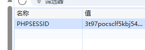
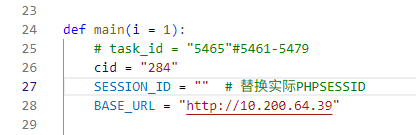

# 合肥工业大学管理学院大数据教学系统报告生成
> 用于合肥工业大学管理学院大数据教学系统中各项任务的报告生成。注意，本代码无法代替人工执行虚拟机操作，用于将图片保存后替换报告中的内容
# 开始使用
1. 首先确定你所在项目与我的模板模板一致。
2. 打开浏览器获取cookie中的PHPSESSID值（这里默认大家知道能获取哦）

3. 填入代码中并适当修改taskid即可运行

# 免责申明
由于本系统在局域网中运行，所以请确保可用性，另外本代码并不能代替学习！不能代替学习！只是为了帮助大家节约时间做更有意义的事。